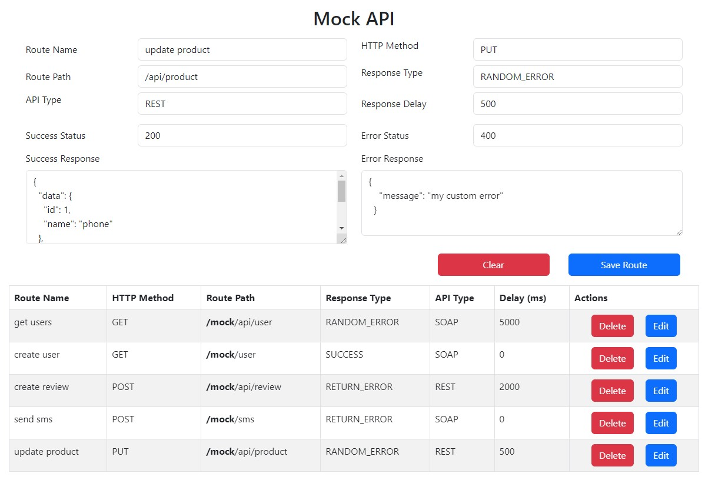

# HTTP Mock Server / REST & SOAP

## Simple node.js express server for testing purposes

<h1 align="center">
  
</h1>

### How to run

- configure .env file

- run following commands below

```
    npm i
    node server.js

```

### Response format:

- This response will return when you send a request:

| Parameter       | Type     | Description                             |
| :-------------- | :------- | :-------------------------------------- |
| `data`          | `string` | **Required**. your data can be obj/list |
| `error`         | `string` | **Required**. your error response       |
| `successStatus` | `string` | **Required**.                           |
| `errorStatus`   | `string` | **Required**.                           |


## If you want to add routes manually:

- Create a route in related file (restMock/soapMock):

```
    // rest route example
    app.get("/user", express.json(), (req, res) => {
        getUsers(req, res, ResponseType.RANDOM_ERROR);
    });

    // soap route example
    app.get("/user", (req, res) => {
        res.set("Content-Type", "application/soap+xml"); // *important
        getUsers(req, res);
    });

```

#### Show Errors:

- You can show errors randomly by giving "ResponseType". Default is "SUCCESS" :

```
    ResponseType = {
    RETURN_ERROR: "RETURN_ERROR",
    RANDOM_ERROR: "RANDOM_ERROR",
    SUCCESS: "SUCCESS",
    };

    getUserById(req, res);
    getUserById(req, res, ResponseType.RANDOM_ERROR);
```

## Example Responses:

- **REST**

```
[
    {
        "id": 1,
        "username": "grkn"
    },
    {
        "id": 2,
        "username": "ali"
    },
    {
        "id": 3,
        "username": "veli"
    }
]
```

- **SOAP**

```
<soap:Envelope xmlns:soap='http://www.w3.org/2003/05/soap-envelope'>
    <soap:Body>
        <users>
            <user>
                <id>1</id>
                <name>grkn</name>
            </user>
            <user>
                <id>2</id>
                <name>ali</name>
            </user>
            <user>
                <id>3</id>
                <name>veli</name>
            </user>
        </users>
    </soap:Body>
</soap:Envelope>
```
